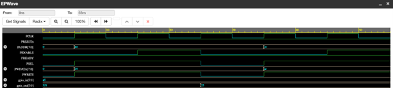

# Design and Verification of APB to GPIO Interface Using SystemVerilog

---

## Table of Contents
- [Overview](#overview)
- [Architecture](#architecture)
- [Verification Environment](#verification-environment)
- [APB Protocol — Write & Read Timing](#apb-protocol--write--read-timing)
- [Project Structure](#project-structure)
- [Simulation Results](#simulation-results)
- [Waveform](#waveform)
- [How to Run](#how-to-run)
- [Key Concepts Demonstrated](#key-concepts-demonstrated)

---

## Overview

This project implements and verifies an **AMBA APB (Advanced Peripheral Bus) to GPIO interface** using SystemVerilog. The design models a GPIO peripheral acting as an APB slave, capable of receiving data from an APB master (write) and returning data back (read).

The verification environment is built using **object-oriented SystemVerilog** — with a layered testbench consisting of a Transaction class, Generator, Driver, Monitor, and Scoreboard — connected via mailboxes and virtual interfaces.

**Key highlights:**
- 8-bit APB-compliant GPIO slave (PADDR, PWDATA, PRDATA, PSEL, PENABLE, PWRITE, PREADY)
- Constrained-random stimulus generation (50% read / 50% write distribution)
- 6 randomized transactions verified across write and read cycles
- Simulation completed at **55 ns** with **0 errors, 0 warnings**
- Waveform verified in EPWave for APB timing compliance

---

## Architecture

```
┌─────────────────────────────────────────────────────────────┐
│                      TESTBENCH (tb)                         │
│                                                             │
│   ┌───────────┐   mailbox    ┌───────────┐                  │
│   │ Generator │ ──gen2drv──► │  Driver   │                  │
│   │           │              │           │                  │
│   │ Randomized│              │ APB Master│                  │
│   │ TXN (x6)  │              │ Behavior  │                  │
│   └───────────┘              └─────┬─────┘                  │
│         │ event(done)              │ virtual if             │
│         ▼                    ┌─────▼──────────────┐         │
│   ┌───────────┐              │   apb_if (Interface)│        │
│   │  Monitor  │◄─drv2mon─   │  PCLK, PRESETn      │         │
│   │           │   mailbox   │  PADDR, PWDATA       │        │
│   │ Observes  │             │  PRDATA, PSEL        │        │
│   │ TXNs      │             │  PENABLE, PWRITE     │        │
│   └───────────┘             └─────────┬────────────┘        │
│                                       │                     │
│                             ┌─────────▼──────────┐          │
│                             │    DUT (design.sv) │          │
│                             │  GPIO Slave Module │          │
│                             │  gpio_out [7:0]    │          │
│                             │  gpio_in  = 0xA5   │          │
│                             └────────────────────┘          │
└─────────────────────────────────────────────────────────────┘
```

---

## Verification Environment

| Component | File | Role |
|---|---|---|
| Transaction | `transaction.sv` | Defines APB transfer object (addr, data, rw); constrained-random |
| Generator | `generator.sv` | Creates 6 randomized transactions; triggers `done` event on finish |
| Driver | `driver.sv` | Implements APB master — calls `apb_write()` / `apb_read()` via interface |
| Monitor | `monitor.sv` | Passive observer; receives completed transactions via mailbox and logs them |
| Interface | `apb_if.sv` | Encapsulates all APB signals; provides `apb_write()` and `apb_read()` tasks |
| DUT | `design.sv` | 8-bit GPIO slave; latches write data into `gpio_out`; drives `gpio_in` on read |
| Testbench | `testbench.sv` | Top-level; instantiates all components; runs Generator, Driver, Monitor in `fork...join_none` |

### Inter-Component Communication

```
Generator ──[gen2drv mailbox]──► Driver ──[drv2mon mailbox]──► Monitor
              Transaction objects          Transaction objects
                    │
               [done event]
                    │
              Testbench ends
```

---

## APB Protocol — Write & Read Timing

### Write Cycle (PWRITE = 1)
```
Cycle:     1           2           3
        ___________             ___
PCLK  _|           |___________|
           _______________________
PSEL  ____|                       |___
                    _______________
PENABLE __________|               |___
           _______________________
PWRITE ____|                       |___
           _______
PADDR  XXXX  addr  XXXXXXXXXXXXXXXXXXXX
                ___
PWDATA XXXXXXXXX data XXXXXXXXXXXXXXXXX
```

### Read Cycle (PWRITE = 0)
```
Cycle:     1           2           3           4
        ___________             ___________
PCLK  _|           |___________|           |__
           _______________________________
PSEL  ____|                               |___
                    ___________________
PENABLE __________|                   |_______
                                ______
PRDATA XXXXXXXXXXXXXXXXXXXXXXXXX data XXXXXXXX
```

---

## Project Structure

```
design-and-verification-of-APB-to-GPIO-interface-using-SystemVerilog/
│
├── Code/
│   ├── apb_if/
│   │   └── apb_if.sv          # APB interface with write/read tasks
│   ├── design/
│   │   └── design.sv          # GPIO DUT (APB slave)
│   ├── transaction/
│   │   └── transaction.sv     # Randomized transaction class
│   ├── generator/
│   │   └── generator.sv       # Stimulus generator
│   ├── driver/
│   │   └── driver.sv          # APB master driver
│   ├── monitor/
│   │   └── monitor.sv         # Passive observer
│   └── testbench/
│       └── testbench.sv       # Top-level testbench
│
├── Output/
│   ├── Log-file/
│   │   └── apb_gpio.log       # Full simulation console log
│   └── Output-waveform/
│       └── Output-Waveform.png
│
└── Report/
    └── APB-GPIO Project Report.pdf
```

---

## Simulation Results

**Simulator:** Aldec Riviera-PRO 2023.04 via EDA Playground  
**Timescale:** 1ns/1ns | **Clock Period:** 10ns (100 MHz) | **Total Sim Time:** 55 ns  
**Compile:** ✅ 0 Errors, 0 Warnings

### Console Log (Condensed)

```
===============================================
   APB TO GPIO TESTBENCH STARTED
===============================================
[0]  GEN: Generating 6 transactions
[0]  GEN -> TXN: addr=0x40  data=0x25  rw=0  (WRITE)
[0]  GEN -> TXN: addr=0x2c  data=0xac  rw=0  (WRITE)
[0]  GEN -> TXN: addr=0x8b  data=0xe0  rw=1  (READ)
[0]  GEN -> TXN: addr=0x6e  data=0x6d  rw=1  (READ)
[0]  GEN -> TXN: addr=0x0d  data=0x21  rw=1  (READ)
[0]  GEN -> TXN: addr=0x1c  data=0x42  rw=1  (READ)
[0]  GEN: Done

[0]  DRV: Started
[0]  MON: Started
[0]  DRV <- TXN: addr=0x40  data=0x25  rw=0
[25] APB_IF: Write Addr=0x40  Data=0x25
[25] MON observed TXN: addr=0x40  data=0x25  rw=0
===============================================
   TEST COMPLETED SUCCESSFULLY
===============================================
```

### Transaction Summary

| # | Address | Data | Operation | Result |
|---|---------|------|-----------|--------|
| 1 | 0x40 | 0x25 | WRITE | ✅ Pass |
| 2 | 0x2C | 0xAC | WRITE | ✅ Pass |
| 3 | 0x8B | —    | READ (0xA5) | ✅ Pass |
| 4 | 0x6E | —    | READ (0xA5) | ✅ Pass |
| 5 | 0x0D | —    | READ (0xA5) | ✅ Pass |
| 6 | 0x1C | —    | READ (0xA5) | ✅ Pass |

> GPIO read always returns `0xA5` (hardcoded `gpio_in` value), confirming correct PRDATA routing.

---

## Waveform



**Waveform observations:**
- `PCLK` toggles continuously at 100 MHz
- `PSEL` and `PENABLE` assert correctly in sequence for each transaction
- `PWRITE=1` with valid `PADDR` and `PWDATA` during write cycles
- `PWRITE=0` with `PRDATA=0xA5` captured during read cycles
- `gpio_out` updates correctly after each write operation
- All APB timing requirements satisfied relative to `PCLK` edges

---

## How to Run

### Option 1: EDA Playground (Recommended — No install needed)

1. Go to [https://www.edaplayground.com](https://www.edaplayground.com)
2. Select **Aldec Riviera-PRO** as the simulator
3. Upload files in this order (all from `Code/` subfolders):
   - `apb_if.sv`
   - `transaction.sv`
   - `generator.sv`
   - `driver.sv`
   - `monitor.sv`
   - `design.sv`
   - `testbench.sv` (set as top-level)
4. Set timescale to `1ns/1ns`
5. Click **Run** — check console output and open EPWave for waveform

### Option 2: Local Simulator (ModelSim / QuestaSim)

```bash
# From the Code/ directory, compile all files
vlog -sv apb_if/apb_if.sv \
        transaction/transaction.sv \
        generator/generator.sv \
        driver/driver.sv \
        monitor/monitor.sv \
        design/design.sv \
        testbench/testbench.sv

# Run simulation
vsim -c tb -do "run -all; exit"

# View waveform (if using ModelSim GUI)
vsim tb
add wave /*
run -all
```

### Option 3: Icarus Verilog + GTKWave (Free & Open Source)

```bash
# Compile
iverilog -g2012 -o apb_gpio \
  Code/apb_if/apb_if.sv \
  Code/transaction/transaction.sv \
  Code/generator/generator.sv \
  Code/driver/driver.sv \
  Code/monitor/monitor.sv \
  Code/design/design.sv \
  Code/testbench/testbench.sv

# Simulate (generates apb_gpio.vcd)
vvp apb_gpio

# View waveform
gtkwave apb_gpio.vcd
```

---

## Key Concepts Demonstrated

| Concept | Where Used |
|---|---|
| OOP in SystemVerilog | Transaction, Generator, Driver, Monitor as classes |
| Virtual Interface | Driver and Monitor access DUT signals via `virtual apb_if` |
| Mailbox (`mailbox #(T)`) | Inter-component communication: gen→drv, drv→mon |
| Constrained Randomization | `rand` fields in Transaction with `rw dist {0:=50, 1:=50}` |
| `fork...join_none` | Parallel execution of Generator, Driver, Monitor |
| Event Synchronization | `event done` triggers testbench shutdown after all TXNs |
| AMBA APB Protocol | Setup phase → Enable phase timing modeled in `apb_if` tasks |
| Assertion-ready design | `PSEL`, `PENABLE`, `PWRITE` sequencing verifiable via SVA |

---

*Simulated using Aldec Riviera-PRO on EDA Playground. Report available in the `Report/` folder.*
